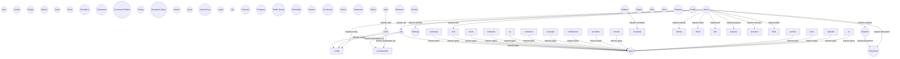

<!-- GENERATED by c4-gen views --format=mermaid — do not edit -->

# C4 — Components -- Client — component

Component-level view of Client

```mermaid
graph TB
  alert(("Alert"))
  api(("Api"))
  auth(("Auth"))
  avatar(("Avatar"))
  badge(("Badge"))
  button(("Button"))
  card(("Card"))
  chart(("Chart"))
  checkbox(("Checkbox"))
  command(("Command"))
  command_palette(("Command Palette"))
  dialog(("Dialog"))
  dropdown_menu(("Dropdown Menu"))
  explorer(("Explorer"))
  filesystem(("Filesystem"))
  hooks(("Hooks"))
  input(("Input"))
  input_group(("Input Group"))
  label(("Label"))
  lib(("Lib"))
  popover(("Popover"))
  progress(("Progress"))
  radio_group(("Radio Group"))
  resizable(("Resizable"))
  routes(("Routes"))
  scroll_area(("Scroll Area"))
  select(("Select"))
  separator(("Separator"))
  settings(("Settings"))
  sheet(("Sheet"))
  sidebar(("Sidebar"))
  skeleton(("Skeleton"))
  sonner(("Sonner"))
  stores(("Stores"))
  switch(("Switch"))
  tabs(("Tabs"))
  tauri(("Tauri"))
  textarea(("Textarea"))
  tooltip(("Tooltip"))
  types(("Types"))
  utils(("Utils"))
  api -->|"imports config"| config
  api -->|"imports pocketpaw_ee"| pocketpawee
  api -->|"imports types"| types
  auth -->|"imports config"| config
  auth -->|"imports pocketpaw_ee"| pocketpawee
  bootstrap -->|"imports types"| types
  chat -->|"imports types"| types
  cloud -->|"imports types"| types
  composio -->|"imports types"| types
  ee -->|"imports types"| types
  explorer -->|"imports filesystem"| filesystem
  extraction -->|"imports types"| types
  foresight -->|"imports types"| types
  notifications -->|"imports types"| types
  providers -->|"imports types"| types
  shared -->|"imports types"| types
  sidebar -->|"imports constants"| constants
  stores -->|"imports activity"| activity
  stores -->|"imports api"| api
  stores -->|"imports chat"| chat
  stores -->|"imports client"| client
  stores -->|"imports config"| config
  stores -->|"imports explorer"| explorer
  stores -->|"imports filesystem"| filesystem
  stores -->|"imports kits"| kits
  stores -->|"imports projects"| projects
  stores -->|"imports sessions"| sessions
  stores -->|"imports settings"| settings
  stores -->|"imports skills"| skills
  surface -->|"imports types"| types
  tests -->|"imports types"| types
  uploads -->|"imports types"| types
  utils -->|"imports auth"| auth
  v1 -->|"imports types"| types
```
