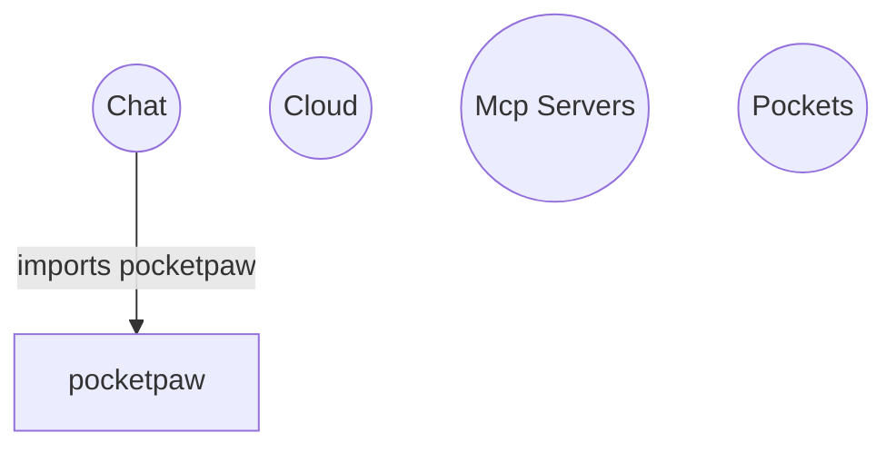

<!-- GENERATED by c4-gen views --format=mermaid — do not edit -->

# C4 — Components -- Ee — component

Component-level view of Ee

```mermaid
graph TB
  chat(("Chat"))
  ee_cloud(("Cloud"))
  mcpservers(("Mcp Servers"))
  ee_pockets(("Pockets"))
  chat -->|"imports pocketpaw"| pocketpaw
```
