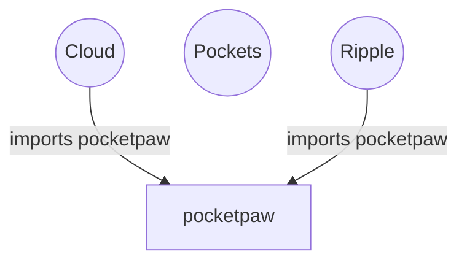

<!-- GENERATED by c4-gen views --format=mermaid — do not edit -->

# C4 — Components -- Pocketpaw — component

Component-level view of Pocketpaw

```mermaid
graph TB
  cloud(("Cloud"))
  pockets(("Pockets"))
  ripple(("Ripple"))
  cloud -->|"imports pocketpaw"| pocketpaw
  ripple -->|"imports pocketpaw"| pocketpaw
```
