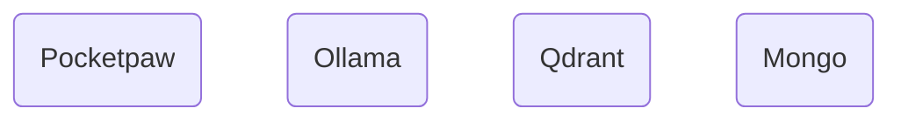

<!-- GENERATED by c4-gen views --format=mermaid — do not edit -->

# C4 — Containers -- pocketpaw — container

Container-level view of pocketpaw

```mermaid
graph TB
  pocketpaw("Pocketpaw")
  ollama("Ollama")
  qdrant("Qdrant")
  mongo("Mongo")
```
