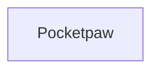

<!-- GENERATED by c4-gen views --format=mermaid — do not edit -->

# C4 — System Context -- pocketpaw — context

How pocketpaw fits in its ecosystem

```mermaid
graph TB
  pocketpaw["Pocketpaw"]
```
